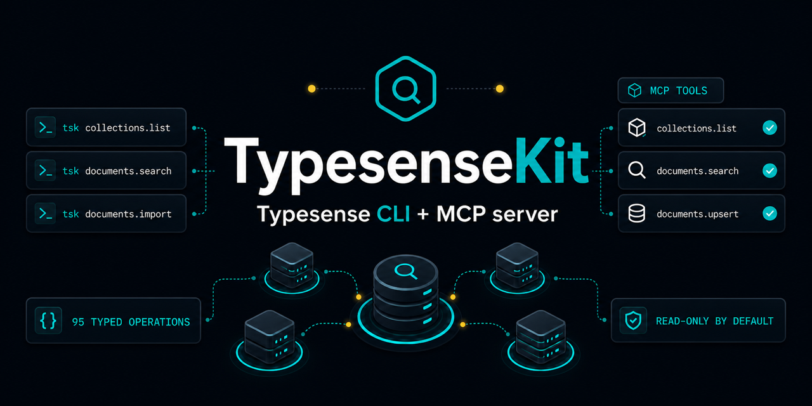

# TypesenseKit



[](https://github.com/akshitkrnagpal/typesensekit/actions/workflows/ci.yml)
[](https://www.npmjs.com/package/@typesensekit/cli)
[](https://www.npmjs.com/package/@typesensekit/mcp)
[](./LICENSE)

## Operate Typesense from your terminal or AI agent

TypesenseKit gives operators, automation, and AI agents one typed operation registry for the Typesense Admin API—with a human-friendly CLI and a secure MCP server built on top.

**[Website](https://typesensekit.vercel.app)** · **[Typesense CLI](https://typesensekit.vercel.app/typesense-cli/)** · **[Typesense MCP](https://typesensekit.vercel.app/typesense-mcp/)** · **[Guides](https://typesensekit.vercel.app/guides/clients/)**

```sh
pnpm add -g @typesensekit/cli

# Securely prompts for the API key
tsk profile add local --url http://localhost:8108
tsk profile use local

# Discover the input, then run the operation
tsk documents.search --examples
tsk documents.search --input '{"collection":"products","params":{"q":"oak chair","query_by":"title"}}' --json
```

## Why TypesenseKit

Typesense work often jumps between dashboards, one-off scripts, local curl commands, and agent experiments. TypesenseKit keeps those workflows on one predictable surface:

- Use the same operation names from the CLI and MCP server.
- Validate structured inputs before requests reach Typesense.
- Get readable terminal output or stable, redacted JSON for scripts.
- Keep secrets out of shell history with secure prompts, stdin, or macOS Keychain profiles.
- Confirm destructive CLI operations before they run.
- Give AI clients read-only tools by default, then opt in to writes deliberately.
- Reach newer or uncommon endpoints through the raw `api.call` escape hatch.

| | One-off scripts | Typesense client | Basic MCP wrapper | TypesenseKit |
| --- | --- | --- | --- | --- |
| Terminal-first workflow | Manual | — | — | Built in |
| MCP tools | — | — | Yes | Yes |
| Shared CLI/MCP operations | — | — | Varies | Yes |
| Safe operational defaults | You build them | Application-owned | Varies | Read-only + confirmations |

Use the official Typesense client in application code. Use TypesenseKit when humans, scripts, and agents need to perform the same operational work.

## CLI

Install the public CLI package:

```sh
pnpm add -g @typesensekit/cli
```

Create a profile interactively, pipe a key over stdin for automation, or use macOS Keychain:

```sh
# Interactive secure prompt
tsk profile add local --url http://localhost:8108

# Scripted setup without putting the key in argv or shell history
printf '%s' "$TYPESENSE_API_KEY" | tsk profile add ci \
  --url https://search.example.com --api-key-stdin

# Keychain-backed profile on macOS
tsk profile add production --url https://search.example.com --keychain
```

Every operation supports generated schemas and examples. Common results render as tables; pass `--json` for stable automation output.

```sh
tsk operations
tsk collections.list --input '{}'
tsk documents.search --schema
tsk documents.search --examples
tsk collections.list --input '{}' --json
```

Enable shell completion:

```sh
source <(tsk completion zsh)
source <(tsk completion bash)
tsk completion fish | source
```

See the **[Typesense CLI overview](https://typesensekit.vercel.app/typesense-cli/)** or read the **[complete CLI guide](https://typesensekit.vercel.app/guides/cli/)** for profiles, environment-only use, JSON input, completion, and destructive-operation behavior.

## MCP Server

Run the stdio server directly. It exposes search, reads, collection metadata, configuration reads, and system status operations by default.

```sh
TYPESENSE_URL=http://localhost:8108 \
TYPESENSE_API_KEY=xyz \
pnpm dlx @typesensekit/mcp
```

Write, delete, key-management, and raw API tools stay hidden unless full access is explicitly enabled:

```sh
TYPESENSEKIT_READ_ONLY=false \
TYPESENSE_URL=http://localhost:8108 \
TYPESENSE_API_KEY=xyz \
pnpm dlx @typesensekit/mcp
```

Generate client configuration from the CLI:

```sh
tsk skills mcp
tsk skills claude-desktop
tsk skills claude-code
tsk skills hermes
```

See the **[Typesense MCP overview](https://typesensekit.vercel.app/typesense-mcp/)**, **[MCP guide](https://typesensekit.vercel.app/guides/mcp/)**, and **[client setup guide](https://typesensekit.vercel.app/guides/clients/)** for Claude Desktop, Claude Code, Codex, Cursor, generic MCP clients, Streamable HTTP, and Docker.

### MCP resources

| Resource | Purpose |
| --- | --- |
| `typesensekit://operations` | Operations exposed by the current MCP mode |
| `typesensekit://read-only-tools` | Tools included in the default read-only mode |
| `typesense://collections/{collection}/schema` | Collection schema lookup |
| `typesense://collections/{collection}/documents/{id}` | Document lookup |

## What You Can Operate

TypesenseKit targets the Typesense v30.2 API for current first-class operations:

- Collections, schema changes, documents, imports, exports, search, multi-search, facets, and suggestions
- Aliases, presets, global synonym and curation sets, stopwords, stemming dictionaries, and legacy collection configuration
- API keys, analytics rules and events, natural-language search models, conversations, and conversation history
- Health, metrics, stats, debug information, snapshots, slow-request logging, database maintenance, and other system operations

The generated **[API coverage inventory](./docs/api-coverage.md)** is the source of truth for operation names and compatibility notes. Use `api.call` for endpoints that are new, uncommon, or not yet wrapped.

## Security

Typesense administration touches data and credentials. Keep the MCP server read-only for assistant-facing deployments, use narrowly scoped Typesense keys, and protect any Streamable HTTP deployment with authentication and network controls.

- [MCP security and production guidance](./docs/mcp-security.md)
- [Streamable HTTP and Docker](./docs/mcp-http-docker.md)
- [Assistant search with citations](./examples/assistant-search-citations.md)

## Development

```sh
corepack enable
pnpm install
pnpm check
```

Run a local Typesense server:

```sh
docker run -p 8108:8108 \
  -e TYPESENSE_API_KEY=xyz \
  -e TYPESENSE_DATA_DIR=/data \
  typesense/typesense:30.2 --enable-cors
```

Run the landing page locally:

```sh
pnpm dev:web
```

See [CONTRIBUTING.md](./CONTRIBUTING.md) for development and release rules.

## License

[MIT](./LICENSE)
